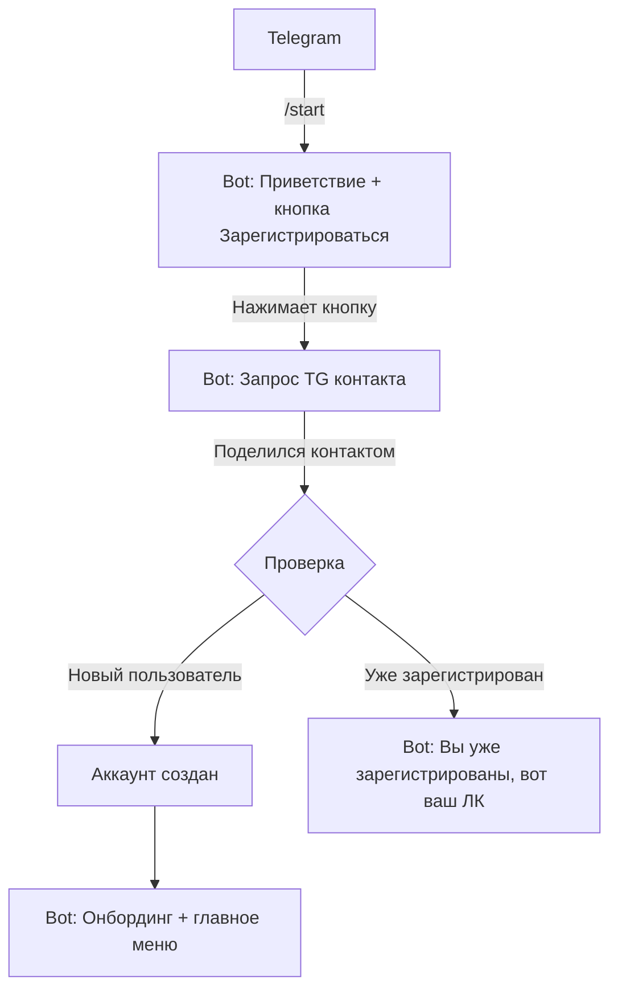
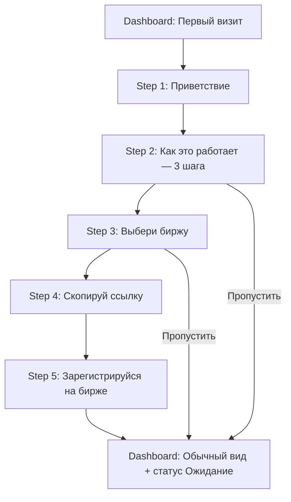
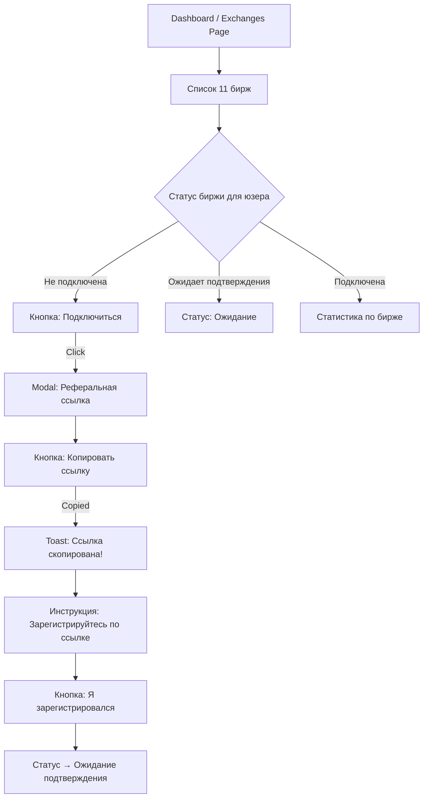
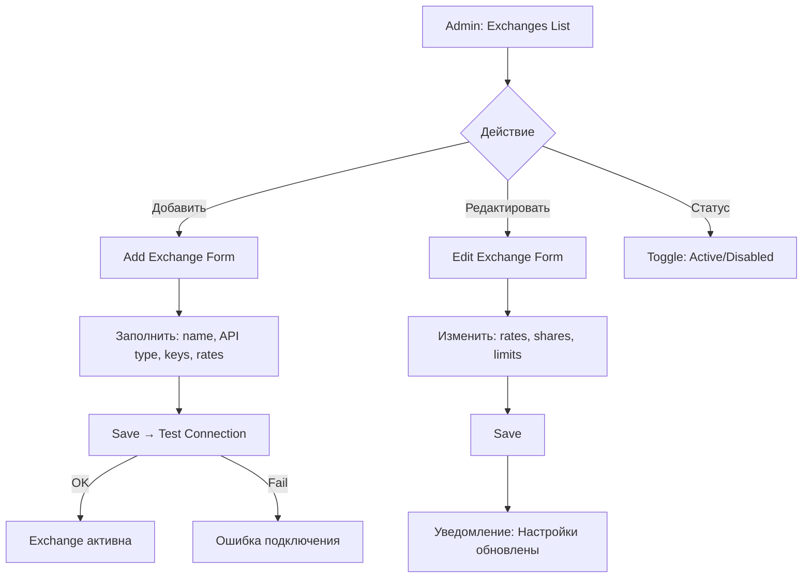
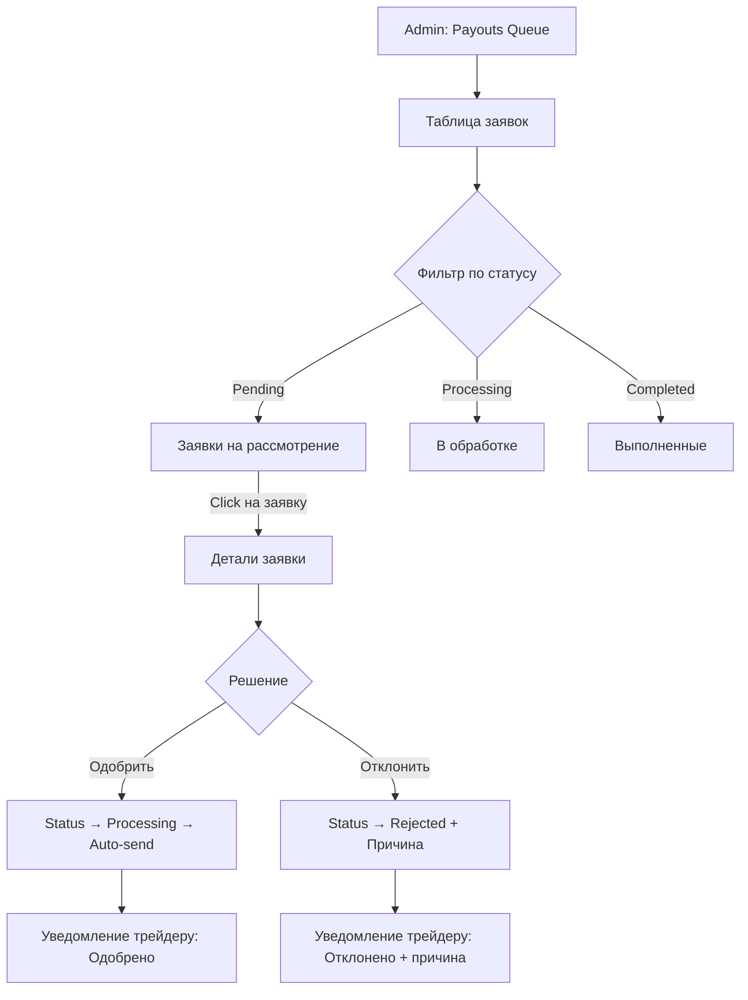

# User Flows: CryptoRebate

> Пользовательские потоки для всех ключевых сценариев MVP

---

## Обзор User Flows

| ID | Flow | Persona | Сложность | Экранов |
|----|------|---------|-----------|---------|
| UF-001 | Регистрация (Web) | Newcomer Maria | Simple | 4 |
| UF-002 | Регистрация (Telegram) | Trader Alex | Simple | 3 |
| UF-003 | Авторизация (Web + TG) | Trader Alex | Simple | 3 |
| UF-004 | Онбординг (первое использование) | Newcomer Maria | Medium | 5 |
| UF-005 | Подключение к бирже | Trader Alex | Medium | 4 |
| UF-006 | Просмотр дашборда и статистики | Trader Alex | Simple | 2 |
| UF-007 | Вывод средств | Trader Alex | Complex | 6 |
| UF-008 | Управление биржами (Admin) | Admin Ops | Complex | 5 |
| UF-009 | Управление выплатами (Admin) | Admin Ops | Medium | 4 |
| UF-010 | Telegram Bot — основной flow | Trader Alex | Medium | 6 |

---

## UF-001: Регистрация через Email (Web)

**Persona:** Newcomer Maria
**Goal:** Создать аккаунт и получить доступ к сервису
**Entry Point:** Landing Page → CTA "Зарегистрироваться" или прямой URL /register
**User Stories:** US-001

### Flow Diagram

```mermaid
flowchart TD
    A[Landing Page] -->|CTA: Зарегистрироваться| B[/register]
    B --> C{Выбор метода}
    C -->|Email| D[Форма: email + пароль]
    C -->|Telegram| E[Redirect: TG OAuth]
    D --> F{Валидация}
    F -->|OK| G[Аккаунт создан]
    F -->|Email занят| H[Ошибка: email занят]
    F -->|Слабый пароль| I[Ошибка: требования к паролю]
    H -->|Попробовать войти| J[/login]
    I -->|Исправить| D
    G --> K[/dashboard — Онбординг]
```

### Шаги

| # | Screen | User Action | System Response | Success Criteria |
|---|--------|-------------|-----------------|------------------|
| 1 | Landing / Register | Нажимает CTA "Зарегистрироваться" | Открывает форму регистрации | Форма загружена < 1с |
| 2 | Register Form | Выбирает метод: Email | Показывает поля email + пароль | Поля видимы |
| 3 | Register Form | Вводит email + пароль, жмёт "Зарегистрироваться" | Валидация → создание аккаунта → JWT | Аккаунт в БД, JWT получен |
| 4 | Dashboard | Видит онбординг | Показывает приветствие + гайд | Онбординг отображён |

### Error Paths

| Error | Trigger | Message | Recovery |
|-------|---------|---------|----------|
| E1: Email занят | Email уже в БД | "Этот email уже зарегистрирован. Войти?" | Ссылка на /login |
| E2: Невалидный email | Некорректный формат | "Проверьте email — кажется, в нём ошибка" | Inline validation |
| E3: Слабый пароль | < 8 символов / без цифры | "Минимум 8 символов, 1 цифра, 1 буква" | Inline hint |
| E4: Сеть | Нет соединения | "Не удалось соединиться. Проверьте интернет" | Retry кнопка |

---

## UF-002: Регистрация через Telegram

**Persona:** Trader Alex
**Goal:** Создать аккаунт через Telegram-бот
**Entry Point:** Telegram → /start CryptoRebateBot

### Flow Diagram



### Шаги

| # | Screen | User Action | System Response |
|---|--------|-------------|-----------------|
| 1 | Telegram Chat | Отправляет /start | Приветственное сообщение + inline кнопка |
| 2 | Telegram Chat | Нажимает "Зарегистрироваться" | Запрос на share contact |
| 3 | Telegram Chat | Делится контактом | Аккаунт создан, показано главное меню |

---

## UF-003: Авторизация (Web)

**Persona:** Trader Alex
**Goal:** Войти в личный кабинет
**Entry Point:** /login или Header → "Войти"

### Flow Diagram

```mermaid
flowchart TD
    A[/login] --> B{Метод}
    B -->|Email| C[Ввод email + пароль]
    B -->|Telegram| D[TG Widget Login]
    C --> E{Валидация}
    E -->|OK| F[JWT access+refresh → /dashboard]
    E -->|Неверные данные| G[Ошибка: Неверный email или пароль]
    G -->|Retry| C
    G -->|Забыл пароль| H[/reset-password]
    D --> I{TG Auth OK?}
    I -->|Да| F
    I -->|Нет| J[Ошибка авторизации TG]
```

---

## UF-004: Онбординг (Первое использование)

**Persona:** Newcomer Maria
**Goal:** Понять как работает сервис и подключить первую биржу
**Entry Point:** Dashboard (сразу после регистрации)

### Flow Diagram



### Шаги

| # | Screen | Контент | User Action |
|---|--------|---------|-------------|
| 1 | Welcome Modal | "Добро пожаловать! Давайте настроим ваш rebate" | "Начать" / "Пропустить" |
| 2 | How it works | 3 шага с иконками: Зарегистрируйся → Торгуй → Получай cashback | "Далее" |
| 3 | Choose exchange | Список 11 бирж с логотипами и ставками | Выбирает биржу |
| 4 | Copy ref link | Персональная реферальная ссылка + кнопка "Копировать" | Копирует ссылку |
| 5 | Instructions | "Перейдите по ссылке и зарегистрируйтесь на бирже" | "Готово" |

### Metrics

```yaml
Tracked Events:
  - onboarding_started
  - onboarding_step_viewed (step: 1-5)
  - onboarding_completed
  - onboarding_skipped (step: N)
  - referral_link_copied (exchange: name)

KPIs:
  - Completion rate: target > 70%
  - Time to complete: target < 3 мин
  - Ref link copy rate: target > 60%
```

---

## UF-005: Подключение к бирже (Копирование реф. ссылки)

**Persona:** Trader Alex
**Goal:** Получить реферальную ссылку для биржи и зарегистрироваться
**Entry Point:** Dashboard → Exchanges или Sidebar → "Биржи"

### Flow Diagram



### Статусы подключения к бирже (per user × exchange)

```
not_connected → pending_confirmation → connected → inactive
                                                    ↑
                                                (если перестал торговать)
```

---

## UF-006: Просмотр дашборда и статистики

**Persona:** Trader Alex
**Goal:** Увидеть текущие начисления, баланс, статистику
**Entry Point:** /dashboard (главная страница ЛК)

### Flow Diagram

```mermaid
flowchart TD
    A[/dashboard] --> B[KPI Cards: Баланс, Всего заработано, Активные биржи]
    B --> C[Grafik: Rebate за период]
    C --> D[Таблица: Последние начисления]

    D -->|Click на начисление| E[Детали: биржа, объём, комиссия, rebate]

    B -->|Click: Баланс| F[/withdrawals — история выводов]
    B -->|Click: Биржи| G[/exchanges — список бирж]
```

### Dashboard Layout

```
┌─────────────────────────────────────────────────────────┐
│                     DASHBOARD                            │
├──────────┬──────────┬──────────┬────────────────────────┤
│ Баланс   │ Всего    │ Активных │ В ожидании             │
│ $123.45  │ $456.78  │ 5 бирж   │ $12.34                 │
├──────────┴──────────┴──────────┴────────────────────────┤
│                                                          │
│  📊 Rebate за период    [7д] [30д] [90д] [Всё]          │
│  ┌────────────────────────────────────────────────────┐  │
│  │  ╱╲    ╱╲                                          │  │
│  │ ╱  ╲╱╱  ╲    ╱╲   ╱╲╲                             │  │
│  │╱         ╲╱╱  ╲╱╱   ╲╲                            │  │
│  └────────────────────────────────────────────────────┘  │
│                                                          │
│  Последние начисления                    [Показать все]  │
│  ┌──────────┬────────┬─────────┬────────┬────────────┐  │
│  │ Дата     │ Биржа  │ Объём   │ Rebate │ Статус     │  │
│  ├──────────┼────────┼─────────┼────────┼────────────┤  │
│  │ 03.02    │ Bybit  │ $12,340 │ $4.32  │ ✅ Начислен │  │
│  │ 03.02    │ BingX  │ $8,150  │ $2.93  │ ✅ Начислен │  │
│  │ 02.02    │ OKX    │ $5,200  │ $1.87  │ ⏳ Расчёт   │  │
│  └──────────┴────────┴─────────┴────────┴────────────┘  │
└─────────────────────────────────────────────────────────┘
```

---

## UF-007: Вывод средств (Withdrawal)

**Persona:** Trader Alex
**Goal:** Вывести накопленный rebate на крипто-кошелёк
**Entry Point:** Dashboard → "Вывести" или Sidebar → "Выводы"

### Flow Diagram

```mermaid
flowchart TD
    A[Dashboard / Withdrawals] -->|CTA: Вывести| B[Withdrawal Form]
    B --> C[Ввод: Сумма]
    C --> D[Ввод: Адрес кошелька]
    D --> E[Выбор: Сеть (TRC-20 / ERC-20)]
    E --> F{Валидация}
    F -->|Баланс < Сумма| G[Ошибка: Недостаточно средств]
    F -->|Сумма < Минимум| H[Ошибка: Минимум $10]
    F -->|Невалидный адрес| I[Ошибка: Проверьте адрес]
    F -->|Rate limit| J[Ошибка: Подождите 24ч]
    F -->|OK| K[Confirmation Modal]
    K -->|Подтвердить| L{Auto/Manual?}
    L -->|Auto: <= $100| M[Status: Processing]
    L -->|Manual: > $100| N[Status: Pending Review]
    M --> O{Результат}
    O -->|Успех| P[Status: Completed + tx_hash]
    O -->|Ошибка| Q[Status: Failed → Retry]
    N --> R[Admin одобряет]
    R --> M
    P --> S[Уведомление: TG + Email]
```

### Withdrawal Form Layout

```
┌─────────────────────────────────────────┐
│         💰 Вывод средств                 │
├─────────────────────────────────────────┤
│                                         │
│  Доступный баланс: $123.45              │
│                                         │
│  ┌─────────────────────────────────┐    │
│  │ Сумма                          │    │
│  │ [$_______________] USDT [MAX]  │    │
│  │ Минимум: $10.00                │    │
│  └─────────────────────────────────┘    │
│                                         │
│  ┌─────────────────────────────────┐    │
│  │ Адрес кошелька                 │    │
│  │ [T__________________________]  │    │
│  └─────────────────────────────────┘    │
│                                         │
│  ┌─────────────────────────────────┐    │
│  │ Сеть                           │    │
│  │ (●) TRC-20 (fee ~$1)          │    │
│  │ ( ) ERC-20 (fee ~$5-15)       │    │
│  └─────────────────────────────────┘    │
│                                         │
│  Вы получите: $XX.XX USDT               │
│  Комиссия сети: ~$1.00                  │
│                                         │
│  ┌─────────────────────────────────┐    │
│  │      [  Вывести средства  ]     │    │
│  └─────────────────────────────────┘    │
│                                         │
│  ⚠️ Проверяйте адрес. Отправка на      │
│  неверный адрес необратима.             │
│                                         │
└─────────────────────────────────────────┘
```

### Статусы вывода (отображение в ЛК)

| Статус | Иконка | Описание | Цвет |
|--------|--------|----------|------|
| pending | ⏳ | Ожидает проверки | Yellow |
| approved | ✅ | Одобрен, в очереди | Blue |
| processing | 🔄 | Транзакция отправлена | Blue |
| completed | ✅ | Выполнен | Green |
| failed | ❌ | Ошибка (retry) | Red |
| rejected | 🚫 | Отклонён админом | Red |
| cancelled | ⬜ | Отменён | Gray |

---

## UF-008: Управление биржами (Admin)

**Persona:** Admin Ops
**Goal:** Добавить/настроить биржу в системе
**Entry Point:** Admin Panel → Exchanges

### Flow Diagram



### Admin Exchange Config Form

```
┌─────────────────────────────────────────┐
│      ⚙️ Настройка биржи: MEXC          │
├─────────────────────────────────────────┤
│                                         │
│  Основные                               │
│  ┌─────────────────────────────────┐    │
│  │ Название:     [MEXC          ] │    │
│  │ Статус:       [● Active ▼    ] │    │
│  │ API Type:     [Manual    ▼   ] │    │
│  └─────────────────────────────────┘    │
│                                         │
│  Ставки                                │
│  ┌─────────────────────────────────┐    │
│  │ Affiliate Rate: [50 ]%          │    │
│  │ Trader Share:   [60 ]%          │    │
│  │ Spot Fee Rate:  [0.10]%         │    │
│  │ Futures Fee:    [0.04]%         │    │
│  └─────────────────────────────────┘    │
│                                         │
│  Выплаты                               │
│  ┌─────────────────────────────────┐    │
│  │ Мин. вывод:    [$10     ]       │    │
│  │ Частота:       [Daily ▼  ]      │    │
│  │ Валюта:        [USDT    ]       │    │
│  └─────────────────────────────────┘    │
│                                         │
│  Лимиты                                │
│  ┌─────────────────────────────────┐    │
│  │ Срок реферала: [1080] дней      │    │
│  │ VIP Cap:       [$0  ] (0=нет)   │    │
│  │ Sync interval: [4   ] часов     │    │
│  └─────────────────────────────────┘    │
│                                         │
│  [Тест подключения]  [Сохранить]       │
│                                         │
└─────────────────────────────────────────┘
```

---

## UF-009: Управление выплатами (Admin)

**Persona:** Admin Ops
**Goal:** Одобрить/отклонить заявки на вывод
**Entry Point:** Admin Panel → Payouts

### Flow Diagram



---

## UF-010: Telegram Bot — Основной Flow

**Persona:** Trader Alex
**Goal:** Полноценное управление ЛК через Telegram
**Entry Point:** /start в @CryptoRebateBot

### Flow Diagram

```mermaid
flowchart TD
    A[/start] --> B{Зарегистрирован?}
    B -->|Нет| C[Регистрация через TG]
    B -->|Да| D[Главное меню]

    D --> E[📊 Дашборд]
    D --> F[💱 Биржи]
    D --> G[💰 Вывод]
    D --> H[📋 История]
    D --> I[⚙️ Настройки]

    E --> J[Баланс + Краткая статистика]
    F --> K[Список бирж + Ссылки]
    G --> L[Форма вывода]
    H --> M[История начислений / выводов]
    I --> N[Email, кошелёк, уведомления]
```

### Telegram Bot Menu Structure

```
/start → Главное меню
│
├── 📊 Дашборд
│   ├── Баланс: $XX.XX
│   ├── Всего заработано: $XX.XX
│   ├── Активных бирж: N
│   └── [Подробная статистика →]
│
├── 💱 Биржи
│   ├── Список 11 бирж (статус per user)
│   ├── [Подключиться] → Реферальная ссылка
│   └── [Статистика по бирже]
│
├── 💰 Вывести
│   ├── Доступно: $XX.XX
│   ├── Ввод суммы
│   ├── Ввод адреса
│   ├── Выбор сети (TRC-20 / ERC-20)
│   └── Подтверждение
│
├── 📋 История
│   ├── [Начисления] — таблица
│   └── [Выводы] — таблица
│
└── ⚙️ Настройки
    ├── Email: [изменить]
    ├── Кошелёк по умолчанию: [изменить]
    ├── Уведомления: [вкл/выкл]
    └── Язык: [RU/EN]
```

---

## Edge Cases (общие для всех flows)

| # | Edge Case | Поведение |
|---|-----------|----------|
| EC-1 | Пользователь без интернета | Показать offline message с retry |
| EC-2 | JWT token истёк | Silent refresh через refresh token |
| EC-3 | Refresh token истёк | Redirect на /login |
| EC-4 | Одновременный вход web + TG | Оба работают параллельно (shared session) |
| EC-5 | Биржа на maintenance | Показать статус "Биржа временно недоступна" |
| EC-6 | Нулевой баланс, попытка вывода | CTA: "Подключите биржу и начните торговать" |
| EC-7 | 100+ начислений | Pagination (20 per page) + фильтры |
| EC-8 | Адрес кошелька в неверной сети | Warning: "Убедитесь, что адрес для сети TRC-20" |

---

*Документ создан: UX Agent | Дата: 2026-02-04*
